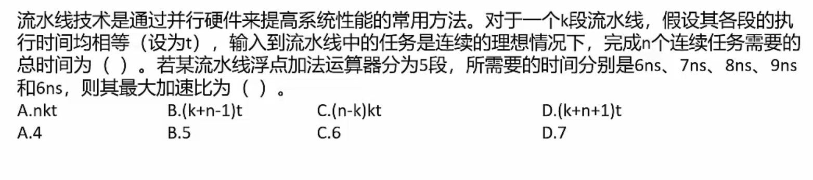
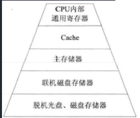
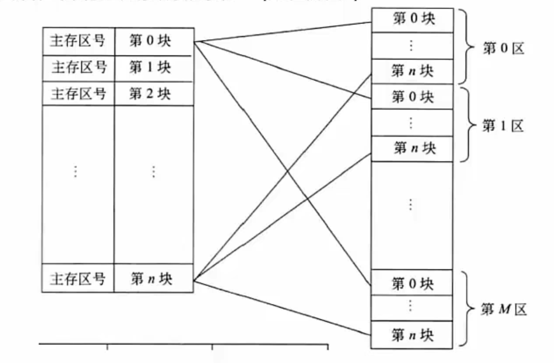

# 系统架构师考试

>## 选择题
>### 计算机基础
>#### 结构组成(冯诺依曼架构)
>* **运算器**(执行所有算术运算，如加减乘除；执行所有逻辑运算并进行逻辑测试，如与，或，非，比较)
>  1. **算术逻辑单元(ALU)**
>     1. 实现对数据的算术和逻辑运算
>  2. **累加寄存器(AC)**
>     1. 运算结果或者输入数据(源操作数)的暂存区
>  3. **数据缓冲寄存器(DR)**
>     1. 暂时存放内存的指令或数据
>  4. **状态条件寄存器(PSW)**
>     1. 保存指令运算结果的条件码内容，例如溢出标志
>
>* **控制器**(控制整个CPU的工作，包括程序控制和时序控制)
>  1. **指令寄存器(IR)**
>     1. 暂存CPU执行的指令
>  2. **程序计算器(PC)**
>     1. 存放将要执行的指令地址
>     2. 执行CPU指令时，在一个指令周期中，首先要从内存读取要执行的指令，此时就要将程序计数器的内容送到地址总线上。
>  3. **地址寄存器(AR)**
>     1. 保存当前CPU所访问的内存地址
>  4. **指令译码器(ID)**
>     1. 分析指令操作码
>
> 
>* **存储器**
>  1. 内存
>  2. 外存
>* 输入设备
>   1. 键盘
>   2. 鼠标
>   3. ......
>* 输出设备
>   1. 打印机
>   2. 屏幕
>   3. ......

>#### 进制转换
>1. 二进制符号:以0b开头 或者 BIN
>2. 八进制符号：以0开头 或者OCT
>3. 十六进制：以0x开头 或者HEX
>   1. 0x18F 也可以表示为18FH
>4. 十进制：DEC
>##### R进制-->十进制
>* **位权展开法**：
> 1. 用R进制的每一位乘以R的n次方
> 2. 次方从右到左分别为0,1,2,3......n
> 3. 例如6进制：5043
>    1. 5043从低到高3,4,0,5
>    2. n分别为：0,1,2,3
>    3. 则十进制为：`3x6^0 + 4x6^1 + 5x6^3 = 1107`
>
> **二进制小数-->十进制**
> 
> 
> 
> **十进制小数-->二进制**
> 
> 
> 
> **二进制-->八进制**
> 
> 
> 
> **八进制-->二进制**
> 
> 
> 
> **二进制-->十六进制**
> 
> 
> 
> **十六进制-->二进制**
> 
> 
> 
>##### 十进制-->R进制
> 余数法
>1. 将要转换的十进制数除以R
>2. 一直除，到0为止
>3. 从下倒上得到结果
>4. 例如：100-->8进制
>   1. 
>
>##### m进制转n进制
>中转法:以10进制中转:m-->10-->n 

>#### 数的表示
>##### 机器数
>* 使用二进制(0,1)表示各种数值，小数点隐含，不占位置
>
>###### 无符号数
>* 表示正数，没有符号位
>###### 带符号数 
>* 最高位为符号位，正数符号位为0，负数符号位为1 
>* 定点表示法：
>  * 纯小数：
>    * 约定小数点在机器数的最高位数值之前
>    * 1101 实际为：0.1101
>  * 纯整数：
>    * 约定小数点在机器数的最低位数值之后
>    * 1101 实际为：1101.0
>  * 真值：
>    * 机器数对应的实际数值

>#### 编码方式
>* **原码**
>  * 一个数的正常二进制表示，最高位表示符号
>* **反码**
>  * 正数的反码是它本身
>  * 负数是除符号位外取反
>  * 0的表示：+0(0 0000000) -0(1 1111111)
>* **补码**
>  * 正数的补码 = 反码 = 原码
>  * 负数的补码 = 负数的反码 + 1
>  * 因此0的补码只有 ：0 0000000 
>* **偏移码**
>  * 补码的符号位取反

>#### 取值范围
>* 机器字长为n时表示的带符号数的取值范围(区别在于0的表示，原码，反码有+0，-0，因此补码可以多表示一个)
>* 
>* 例题：若机器字长为8，写出45，-45的原码，反码，补码，和偏移码
>  * 原码：
>    * 45--> 2x22 + 1 ,2x11 + 0,2x5 + 1,2x2 +1 ,2x1 + 0 , 2x0 + 1,-->0 010 1101 
>    * -45 --> 1 010 1101
>  * 反码：
>    * 45-->0 010 1101
>    * -45--->1 101 0010
>  * 补码：
>    * 45--> 0 0101101
>    * -45-> 1 101 0011
>  * 偏移码：
>    * 45 1 010 1101
>    * -45:0 101 0011
>
>#### 浮点数的表示
>* 表示方法：N = F * 2^E
>  * E:阶码，为带符号的整数，决定了能表示的数值范围
>  * F：尾数，为带符号的小数，决定了数值精度
>  * 类似于科学计数法，二进制：101.011 = 0.101011*2^3
>  * 
>* 尾数表示规格化：
>  * 带符号的尾数的补码必须为：1.0xxxx(负数)，0.1xxxx(正数)，x=0 or 1
>* 浮点数的运算：
>  * 对阶：(使两个数的阶位相等，小阶位像大阶位看齐，类似科学计数法，小阶位加几位，尾数就右移几位)
>  * 尾数计算：(相加，若是减运算就加负数)
>  * 结果规格化：(带符号尾数转换为1.0xxxx 或者0.1xxxx的形式)
    
>#### 校验码
>##### 码距
>* 定义：就单个编码A:00而言，其码距为1，因为只要改变一位就能变成另一个编码。在两个编码中，由A-->B的转换
>* 所需要的位数称为 **码距** ，如A:00-->B:11，码距为2，一般来说，码距越大越利于纠错。
>
>##### 奇偶校验码
>* 原理：增加一位校验位来使得编码中的1的个数为奇数(奇校验)或者偶数(偶校验)，从而是码距变为2。 
>* 奇校验：
>      * 接收方收到后，校验1的个数是否为奇数
>* 偶校验：
>      * 接收方收到后，校验1的个数是否为偶数
>* 局限：
>      * 只能检测一位错误，偶数位同时错误无法校验，无法纠错。
>
>##### 循环冗余校验码(CRC)
>* 原理:
>  * 约定一个生成多项式G(x)。生成校验码的思想就是在原编码后添加若干校验码，使得编码能被G(x)整除。接收方接收信息以后，使用G(x)整除，余数为0，说明没有错误，反之则有误。
>* 使用示例：
>  * 原始信息：1 0110，G(x) = x^4 + x +1,求CRC校验码。
>  * (1)**在原始信息后添加0得到被除数**，G(x)的阶位最高为4，则在原始编码后加4个0，为1 0110 0000，作为被除数；
>  * (2)**由多项式得到除数**，多项式中各个幂指数存在的为1，不存在为0，则由G(x)得到：(43210):存在4,1,0，即除数为10011；
>  * (3)**生成CRC校验码**，将被除数和除数进行模2除法运算(既不进位也不借位的除法：相同就为0，不同就为1)，过程如下图：
>  * 
>  * (4)**生成最终信息串**，将(3)得到的余数添加到原始信息后，即1 0110 1111，发给接收方。
>  * (5)**接收方进行校验**，将接收到的信息串以步骤(2)的方式得到除数，余数为0，则正确，反之则信息有误。收发双方需要使用同样的G(x)。
>* **例题：数据为1100，多项式为：x^3 + x +1,则CRC校验码为()?**
>  * x为3阶，所以被除数为1100000，幂指数位置为(3,1,0)所以除数为1011，
>  * 1100 000 /1011 --->111 000 /1011 ---> 10100 /1011 --> 10 --->补全为3位： **010**
>  * 所以**校验码为：010**，最终信息为1100 010
> 
>##### 海明码(汉明码)
>* 原理：本质也是**利用奇偶性来**检错和纠错，构成方法是在数据位之间的确定位置上插入K个校验位，通过**扩大码距**
>来实现检错和纠错。设数据位为n，校验位为k，那么n与k之间的关系：**2^k >= n+k**
>* **例题：**
>  * 
>* 关键点：**校验位**都在**2^n**次方的位置上(n = 0,1,2,3,4...n)，即数据的第 1,2,4,8,16,32...2^n位。
>* 得到校验码：将信息位的位数拆分成2的幂指数(**校验位**)的形式；
>* 例如第7位，7(I4) = 4 + 2 + 1 = 2^2 + 2^1 + 2^0
>  * 6(I3) = 4 + 2 = 2^2 + 2^1 
>  * 5(I2) = 4 + 1 = 2^2 + 2^0
>  * 3(I1) = 2 +1 = 2^1 + 2^0
>  * 1011 = I4,I3,I2,I1
>  * **校验位由对应的信息位相互异或得出**(异或[XOR] 相同为0，不同为1 )
>  * 7,6,5都含有4(对应r2)，所以r2 = I4 XOR I3 XOR I2 = 1 XOR 0 XOR 1 = 0
>  * 7,6,3 都有2(对应r1),， r1 = I4 XOR I3 XOR I1 = 1 XOR 0 XOR 1 = 0
>  * 7,5,3都有1(对应r0)，r0 = I4 XOR I2 XOR I1 = 1 XOR 1 XOR 1 = 1
>  * 所以最终发出的信息(带校验码)为：
>    * (偶校验)**1010101**
>    * (奇校验：偶校验码取反：110)1011110
>
> ###### 检错和纠错：
> 1. 按同样的过程，生成校验码
> 2. 将生成的校验码与接收的校验码做XOR，正确结果：**偶校验的话，各位校验码的XOR结果都为0，奇校验则都是1**
> 3. 纠错：将XOR得到的结果按照r2r1r0的方式排列就可得出
> 4. **数据位出错**，比如 得到的是(偶校验)1**1**10101
> 5. 数据位为：（4321）：1111，校验位（r2r1r0）：001
> 6. **从数据位计算校验码**与**接收到的校验码XOR**：
> 7. r2 = I4 XOR I3 XOR I2 = 1 XOR 1 XOR 1 = 1 XOR 0 = 1
> 8. r1 = I4 XOR I3 XOR I1 = 1 XOR 1 XOR 1 = 1 XOR 0 = 1
> 9. r0 = I4 XOR I2 XOR I1 = 1 XOR 1 XOR 1 = 1 XOR 1 = 0
> 10. 110--->6,即第六位出错
> * **校验位出错**
> * 
>
> 
>* **考题1**
>* 
>* 由n-->k之间的关系：2^k >= n + k，即2^k >= 32 + k 满足的关系为：64=2^6 >= 32 + 6
>* k为 **6**
>
>* **考题2** 
> 
>* 数据位：D9D8D7D6D5D4D3D2D1D0 = 14,13,12,11,10,9,7,6,5,3
>* D5 = 10 = 8 + 2 = 2^3 + 2^1 --->**p4 和 p2 负责校验**

> #### 体系结构
> 1. 按照处理机数量进行划分：
>    * 单处理系统(一个处理单元和其他设备)
>    * 并行处理系统(多个处理单元互联)
>    * 分布式处理系统(物理上远距离且松耦合的多计算机系统)
> 2. **Flynn分类法：**
>    * 分为**指令流**和**数据流**
>    * 每个指令流有一个控制部分处理，多指令流就有多各控制部分；
>    * 每个数据流都有一个处理器来处理，因此多数据流就有多个处理器；
>    * 主存存储数据和指令，因此无论是多数据流还是多指令流都要多个主存
>    * S：单， M：多，I：指令，D：数据
> 
|       体系结构类型        |               结构               |        关键特性         |             代表              |
|:-------------------:|:------------------------------:|:-------------------:|:---------------------------:|
| 单指令流单数据流 (SISD) | 控制部分：一个 处理器：一个 主存模块：一个 |                     |           单处理器系统            |
| 单指令流多数据流 (SIMD) | 控制部分：一个 处理器：多个 主存模块：多个 |  各处理器以异步的方式执行同一条指令  | 并行处理机 阵列处理机 超级向量处理机 |
| 多指令流单数据流 (MISD) | 控制部分：多个 处理器：一个 主存模块：多个 |     被认为不可能，目前没有     |     目前没有，文献认为是流水线计算机是此类     |
| 多指令流多数据流 (MIMS) | 控制部分：多个 处理器：多个 主存模块：多个 | 能够实现作业，指令，任务等各级全面并行 |       多处理机系统 多计算机       |
> 
> 4. 依据计算机特效，由指令来控制数据传输，因此一条指令可以控制一个或多个数据流，
> 但一条数据流不能被多个指令流控制，否则会出错，因此**多指令单数据MISD不可能**。

>#### 指令系统
> [参考资料1](https://www.zhihu.com/column/c_1263143789159972864)
> [参考资料2](https://blog.csdn.net/ngtnmd/article/details/121799296)
> ##### 指令的组成
> 1. 操作码：决定要完成的操作
> 2. 地址码(操作数的地址)：参与运算的数据及其所在的单元地址
>##### 执行过程
> 1. 取指令
>    * 从程序计数器PC中取出要执行的指令地址，送入地址总线，CPU依据指令地址去内存中取出指令内容
> 存入指令寄存器IR；
> 2. 分析指令
>    * 指令译码器分析分析指令寄存器IR中的指令，分析指令操作码
> 3. 执行指令
>    * 执行指令，取出指令执行所需的源操作数。
> 
>##### 寻址方式
>1. **指令寻址方式**
>   * **顺序寻址方式**：执行指令时，一条指令接着一条的执行。
>   * **跳跃寻址方式**：下一条指令的地址码不是由程序计数器(PC)给出，而是由当前执行的这条指令直接给出，
>。程序跳跃后，按照新的指令地址开始顺序执行，因此，程序计数器的内容也要保持同步，一遍追踪新的指令地址。
>
>2. **指令操作数寻址方式：**
>   * **立即寻址**：
>     * 指令给出的不是操作数的地址，而是操作数本身。
>   * **直接寻址**：
>     * 在指令的地址码给出操作数在主存中的地址。
>   * **间接寻址**：
>     * 在指令地址码中给出的存储单元地址中存储着操作数的地址。
>   * **寄存器寻址**：
>     * 指令中地址码给出的是寄存器编号，操作数在寄存器中。
>   * **寄存器间接寻址**：
>     * 指令中地址码给出的是寄存器编号，寄存器中是操作数的地址。
>   * **基址寻址**：
>     * 将基址寄存器中的地址加上指令地址码给出的地址，再得出操作数的有效地址。
>   * **变址寻址**：
>     * 将变址寄存器中的地址加上指令地址码给出的地址，再得出操作数的有效地址。
>     
>
>
>##### 指令集系统
>1. **CISC:复杂指令集系统**，兼容性强，指令繁多，指令长度**可变**，支持多种寻址方式，由微程序控制(微码)，研制周期长。
>2. **RISC:精简指令集系统**，数量少，指令为**定长格式**，大部分为单周期指令，寻址方式少，增加了**大量通用寄存器**，以硬布线逻辑控制为主
>，适合采用流水线，优化编译，能有效支持高级语言。
>
>##### 流水线
>1. **原理**：将指令分为不同段，每段由不同的部分去处理，因此可以产生叠加效果，所有的部件去处理不同段。
>2. **RISC中的流水线技术**：
>   * (1).**超流水线**(Super Pipe Line)：
>     * 通过细化流水，增加级数和主频，是的每个机器周期内能完成一个甚至两个浮点操作。实质是以时间换空间。
>   * (2).**超标量**(Super Scalar)技术：
>     * 通过内装多条流水线来同时执行多个处理，时钟频率与一般流水线接近，却有更小的CPI，。实质是以空间换时间。
>   * (3).**超长指令字**(Very Long Instruction World,VLIW)技术：
>     * 通过发挥软件的作用，来同时执行多条指令，使得硬件简化，性能提高。 
>
>##### 流水线时间计算
>1. **流水线周期**：指令分为不同段，其中执行时间最长的段为流水线周期
>   * 例如取指令5ns,分析指令：8ns，执行指令：10ns，流水线周期就是10ns
>2. **流水线执行时间**：一条指令总执行时间 + (总指令条数 - 1) x 流水线周期
>3. **流水线吞吐量计算**：吞吐率即单位时间内执行的指令条数。
>   * 计算：指令条数/流水线执行时间
>4. **流水线的加速比计算**：使用流水线后的效率提升量，即比不使用流水线快了多少，越高表明流水线效率越高。
>   * 不使用流水线的执行时间/使用流水线的执行时间
>* **例题1**
>  * 
>  * 计算：
>    * 流水线周期：2ns
>    * 一条指令总执行时间：2 +4 = 6ns
>    * 流水线执行时间： 6 + 99*2 = 204
>    * 吞吐率：100/204*10^-9s = 490*10^6
>* **例题2**：
>   * 
>   * 注意点：单缓冲区的时候，流水线分为2段，即读取 + 送至为一段，用户处理为1段
>   * 第一小题：20 + 1 + 20*9 = 201us
>   * 第二小题：15 +5 + 1 + 15*9  = 156us
>* **例题3**：
>  * 
>  * 第一问：kt + (n-1)*t = (k + n -1)*t
>  * 第二问：
>    * 不使用流水线时间：假设k条，36k 
>    * 使用流水线：36 + (k-1)*9 = 9k + 27
>    * **最大加速比**，当n趋于无穷时，36k/(9k + 27) = 36k/9k = 4
>
><h4>存储系统(不重要)</h4>
>* **分级存储体系**：
>* 
>* 采用分级的原因：
>  * 为了解决存储容量和存储成本，读取速度之间的冲突
>* 两级存储：
>  * Cache<-->主存
>  * 主存<-->外存，辅存
>* **局部性原理**:
>1. 解释：即CPU运行时，所访问的数据会趋向于一个较小的局部空间地址内
>2. **时间局部性**：
>   * 如果一个数据被访问，那么近期内它很有可能被再次访问，即**相邻的时间内会访问同一个数据项**。
>3. **空间局部性**：
>   * 在最近的将来会被用到的地址跟现在被访问的地址很可能是相邻的，即**相邻的空间会被连续访问**。
>* 寄存器：速度极快，但成本高，容量小，KB级
>* Cache：速度很快，容量稍大，一般分三级，MB级
>  * 用来缓存当前最活跃的程序与数据，直接与CPU交互，位于CPU与内存之间，速度是内存的5~10倍。
>内容是内存数据的拷贝，对于程序员是透明的。
>  * Cache由**控制部分**和存储器构成，存储器存储数据，控制部分判断CPU要访问的数据是否在Cache，
>  在就命中，不在就依靠一定的算法从Cache中替换。
>  * **地址映射**：CPU工作时，送出的是内存地址，而要从Cache中读/写信息，需要将内存地址转换成Cache
>存储器地址，这种地址转换称为地址映像，由硬件自动完成，分为下列三种方法：
>    * (1)**直接映像**：
>      * 直接将内存等分成块，Cache也分成块并编号。内存的块与Cache的块的对应关系固定，
>即两者块号相同才能命中。地址变换简单但不灵活，容易造成资源浪费。
>      * 
>    * (2)**全相连映像**:
>    * (3)**组组相连映像**：
> 
> 
> 