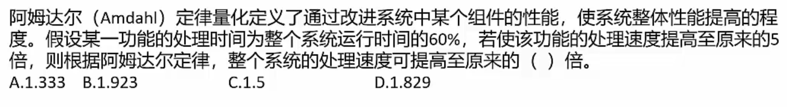

# 系统架构师考试

>## 选择题
>### 计算机基础
>#### 结构组成(冯诺依曼架构)
>1. **运算器**(执行所有算术运算，如加减乘除；执行所有逻辑运算并进行逻辑测试，如与，或，非，比较)
>   1. **算术逻辑单元(ALU)**
>      1. 实现对数据的算术和逻辑运算
>   2. **累加寄存器(AC)**
>      1. 运算结果或者输入数据(源操作数)的暂存区
>   3. **数据缓冲寄存器(DR)**
>      1. 暂时存放内存的指令或数据
>   4. **状态条件寄存器(PSW)**
>      1. 保存指令运算结果的条件码内容，例如溢出标志
>2. **控制器**(控制整个CPU的工作，包括程序控制和时序控制)
>   1. **指令寄存器(IR)**
>      1. 暂存CPU执行的指令
>   2. **程序计算器(PC)**
>      1. 存放将要执行的指令地址
>      2. 执行CPU指令时，在一个指令周期中，首先要从内存读取要执行的指令，此时就要将程序计数器的内容送到地址总线上。
>   3. **地址寄存器(AR)**
>      1. 保存当前CPU所访问的内存地址
>   4. **指令译码器(ID)**
>      1. 分析指令操作码
>3. **存储器**
>   1. 内存
>   2. 外存
>4. 输入设备
>   1. 键盘
>   2. 鼠标
>   3. ......
>5. 输出设备
>   1. 打印机
>   2. 屏幕
>   3. ......

>#### 进制转换
>1. 二进制符号:以0b开头 或者 BIN
>2. 八进制符号：以0开头 或者OCT
>3. 十六进制：以0x开头 或者HEX
>   1. 0x18F 也可以表示为18FH
>4. 十进制：DEC
>##### R进制-->十进制
> 位权展开法：
> 1. 用R进制的每一位乘以R的n次方
> 2. 次方从右到左分别为0,1,2,3......n
> 3. 例如6进制：5043
>    1. 5043从低到高3,4,0,5
>    2. n分别为：0,1,2,3
>    3. 则十进制为：`3x6^0 + 4x6^1 + 5x6^3 = 1107`
>
> **二进制小数-->十进制**
> 
> 
> 
> **十进制小数-->二进制**
> 
> 
> 
> **二进制-->八进制**
> 
> 
> 
> **八进制-->二进制**
> 
> 
> 
> **二进制-->十六进制**
> 
> 
> 
> **十六进制-->二进制**
> 
> 
> 
>##### 十进制-->R进制
> 余数法
>1. 将要转换的十进制数除以R
>2. 一直除，到0为止
>3. 从下倒上得到结果
>4. 例如：100-->8进制
>   1. 
>
>##### m进制转n进制
>中转法:以10进制中转:m-->10-->n 

>#### 校验码
>##### 汉明码
>#####  

>## 案例分析

>## 论文