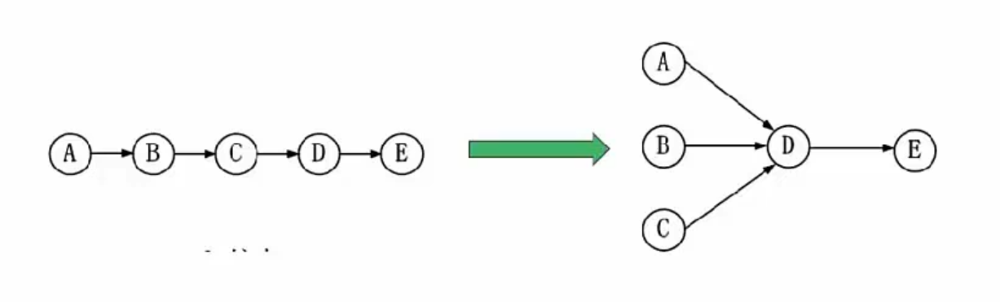
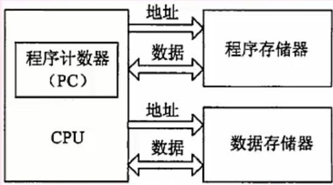

# 系统架构师考试

>## 选择题
>### 计算机基础
>#### 结构组成(冯诺依曼架构)
>* **运算器**(执行所有算术运算，如加减乘除；执行所有逻辑运算并进行逻辑测试，如与，或，非，比较)
>  1. **算术逻辑单元(ALU)**
>     1. 实现对数据的算术和逻辑运算
>  2. **累加寄存器(AC)**
>     1. 运算结果或者输入数据(源操作数)的暂存区
>  3. **数据缓冲寄存器(DR)**
>     1. 暂时存放内存的指令或数据
>  4. **状态条件寄存器(PSW)**
>     1. 保存指令运算结果的条件码内容，例如溢出标志
>
>* **控制器**(控制整个CPU的工作，包括程序控制和时序控制)
>  1. **指令寄存器(IR)**
>     1. 暂存CPU执行的指令
>  2. **程序计算器(PC)**
>     1. 存放将要执行的指令地址
>     2. 执行CPU指令时，在一个指令周期中，首先要从内存读取要执行的指令，此时就要将程序计数器的内容送到地址总线上。
>  3. **地址寄存器(AR)**
>     1. 保存当前CPU所访问的内存地址
>  4. **指令译码器(ID)**
>     1. 分析指令操作码
>
> 
>* **存储器**
>  1. 内存
>  2. 外存
>* 输入设备
>   1. 键盘
>   2. 鼠标
>   3. ......
>* 输出设备
>   1. 打印机
>   2. 屏幕
>   3. ......

>#### 进制转换
>1. 二进制符号:以0b开头 或者 BIN
>2. 八进制符号：以0开头 或者OCT
>3. 十六进制：以0x开头 或者HEX
>   1. 0x18F 也可以表示为18FH
>4. 十进制：DEC
>##### R进制-->十进制
>* **位权展开法**：
> 1. 用R进制的每一位乘以R的n次方
> 2. 次方从右到左分别为0,1,2,3......n
> 3. 例如6进制：5043
>    1. 5043从低到高3,4,0,5
>    2. n分别为：0,1,2,3
>    3. 则十进制为：`3x6^0 + 4x6^1 + 5x6^3 = 1107`
>
> **二进制小数-->十进制**
> 
> 
> 
> **十进制小数-->二进制**
> 
> 
> 
> **二进制-->八进制**
> 
> 
> 
> **八进制-->二进制**
> 
> 
> 
> **二进制-->十六进制**
> 
> 
> 
> **十六进制-->二进制**
> 
> 
> 
>##### 十进制-->R进制
> 余数法
>1. 将要转换的十进制数除以R
>2. 一直除，到0为止
>3. 从下倒上得到结果
>4. 例如：100-->8进制
>   1. 
>
>##### m进制转n进制
>中转法:以10进制中转:m-->10-->n 

>#### 数的表示
>##### 机器数
>* 使用二进制(0,1)表示各种数值，小数点隐含，不占位置
>
>###### 无符号数
>* 表示正数，没有符号位
>###### 带符号数 
>* 最高位为符号位，正数符号位为0，负数符号位为1 
>* 定点表示法：
>  * 纯小数：
>    * 约定小数点在机器数的最高位数值之前
>    * 1101 实际为：0.1101
>  * 纯整数：
>    * 约定小数点在机器数的最低位数值之后
>    * 1101 实际为：1101.0
>  * 真值：
>    * 机器数对应的实际数值

>#### 编码方式
>* **原码**
>  * 一个数的正常二进制表示，最高位表示符号
>* **反码**
>  * 正数的反码是它本身
>  * 负数是除符号位外取反
>  * 0的表示：+0(0 0000000) -0(1 1111111)
>* **补码**
>  * 正数的补码 = 反码 = 原码
>  * 负数的补码 = 负数的反码 + 1
>  * 因此0的补码只有 ：0 0000000 
>* **偏移码**
>  * 补码的符号位取反

>#### 取值范围
>* 机器字长为n时表示的带符号数的取值范围(区别在于0的表示，原码，反码有+0，-0，因此补码可以多表示一个)
>* 
>* 例题：若机器字长为8，写出45，-45的原码，反码，补码，和偏移码
>  * 原码：
>    * 45--> 2x22 + 1 ,2x11 + 0,2x5 + 1,2x2 +1 ,2x1 + 0 , 2x0 + 1,-->0 010 1101 
>    * -45 --> 1 010 1101
>  * 反码：
>    * 45-->0 010 1101
>    * -45--->1 101 0010
>  * 补码：
>    * 45--> 0 0101101
>    * -45-> 1 101 0011
>  * 偏移码：
>    * 45 1 010 1101
>    * -45:0 101 0011
>
>#### 浮点数的表示
>* 表示方法：N = F * 2^E
>  * E:阶码，为带符号的整数，决定了能表示的数值范围
>  * F：尾数，为带符号的小数，决定了数值精度
>  * 类似于科学计数法，二进制：101.011 = 0.101011*2^3
>  * 
>* 尾数表示规格化：
>  * 带符号的尾数的补码必须为：1.0xxxx(负数)，0.1xxxx(正数)，x=0 or 1
>* 浮点数的运算：
>  * 对阶：(使两个数的阶位相等，小阶位像大阶位看齐，类似科学计数法，小阶位加几位，尾数就右移几位)
>  * 尾数计算：(相加，若是减运算就加负数)
>  * 结果规格化：(带符号尾数转换为1.0xxxx 或者0.1xxxx的形式)
    
>#### 校验码
>##### 码距
>* 定义：就单个编码A:00而言，其码距为1，因为只要改变一位就能变成另一个编码。在两个编码中，由A-->B的转换
>* 所需要的位数称为 **码距** ，如A:00-->B:11，码距为2，一般来说，码距越大越利于纠错。
>
>##### 奇偶校验码
>* 原理：增加一位校验位来使得编码中的1的个数为奇数(奇校验)或者偶数(偶校验)，从而是码距变为2。 
>* 奇校验：
>      * 接收方收到后，校验1的个数是否为奇数
>* 偶校验：
>      * 接收方收到后，校验1的个数是否为偶数
>* 局限：
>      * 只能检测一位错误，偶数位同时错误无法校验，无法纠错。
>
>##### 循环冗余校验码(CRC)
>* 原理:
>  * 约定一个生成多项式G(x)。生成校验码的思想就是在原编码后添加若干校验码，使得编码能被G(x)整除。接收方接收信息以后，使用G(x)整除，余数为0，说明没有错误，反之则有误。
>* 使用示例：
>  * 原始信息：1 0110，G(x) = x^4 + x +1,求CRC校验码。
>  * (1)**在原始信息后添加0得到被除数**，G(x)的阶位最高为4，则在原始编码后加4个0，为1 0110 0000，作为被除数；
>  * (2)**由多项式得到除数**，多项式中各个幂指数存在的为1，不存在为0，则由G(x)得到：(43210):存在4,1,0，即除数为10011；
>  * (3)**生成CRC校验码**，将被除数和除数进行模2除法运算(既不进位也不借位的除法：相同就为0，不同就为1)，过程如下图：
>  * 
>  * (4)**生成最终信息串**，将(3)得到的余数添加到原始信息后，即1 0110 1111，发给接收方。
>  * (5)**接收方进行校验**，将接收到的信息串以步骤(2)的方式得到除数，余数为0，则正确，反之则信息有误。收发双方需要使用同样的G(x)。
>* **例题：数据为1100，多项式为：x^3 + x +1,则CRC校验码为()?**
>  * x为3阶，所以被除数为1100000，幂指数位置为(3,1,0)所以除数为1011，
>  * 1100 000 /1011 --->111 000 /1011 ---> 10100 /1011 --> 10 --->补全为3位： **010**
>  * 所以**校验码为：010**，最终信息为1100 010
> 
>##### 海明码(汉明码)
>* 原理：本质也是**利用奇偶性来**检错和纠错，构成方法是在数据位之间的确定位置上插入K个校验位，通过**扩大码距**
>来实现检错和纠错。设数据位为n，校验位为k，那么n与k之间的关系：**2^k >= n+k**
>* **例题：**
>  * 
>* 关键点：**校验位**都在**2^n**次方的位置上(n = 0,1,2,3,4...n)，即数据的第 1,2,4,8,16,32...2^n位。
>* 得到校验码：将信息位的位数拆分成2的幂指数(**校验位**)的形式；
>* 例如第7位，7(I4) = 4 + 2 + 1 = 2^2 + 2^1 + 2^0
>  * 6(I3) = 4 + 2 = 2^2 + 2^1 
>  * 5(I2) = 4 + 1 = 2^2 + 2^0
>  * 3(I1) = 2 +1 = 2^1 + 2^0
>  * 1011 = I4,I3,I2,I1
>  * **校验位由对应的信息位相互异或得出**(异或[XOR] 相同为0，不同为1 )
>  * 7,6,5都含有4(对应r2)，所以r2 = I4 XOR I3 XOR I2 = 1 XOR 0 XOR 1 = 0
>  * 7,6,3 都有2(对应r1),， r1 = I4 XOR I3 XOR I1 = 1 XOR 0 XOR 1 = 0
>  * 7,5,3都有1(对应r0)，r0 = I4 XOR I2 XOR I1 = 1 XOR 1 XOR 1 = 1
>  * 所以最终发出的信息(带校验码)为：
>    * (偶校验)**1010101**
>    * (奇校验：偶校验码取反：110)1011110
>
> ###### 检错和纠错：
> 1. 按同样的过程，生成校验码
> 2. 将生成的校验码与接收的校验码做XOR，正确结果：**偶校验的话，各位校验码的XOR结果都为0，奇校验则都是1**
> 3. 纠错：将XOR得到的结果按照r2r1r0的方式排列就可得出
> 4. **数据位出错**，比如 得到的是(偶校验)1**1**10101
> 5. 数据位为：（4321）：1111，校验位（r2r1r0）：001
> 6. **从数据位计算校验码**与**接收到的校验码XOR**：
> 7. r2 = I4 XOR I3 XOR I2 = 1 XOR 1 XOR 1 = 1 XOR 0 = 1
> 8. r1 = I4 XOR I3 XOR I1 = 1 XOR 1 XOR 1 = 1 XOR 0 = 1
> 9. r0 = I4 XOR I2 XOR I1 = 1 XOR 1 XOR 1 = 1 XOR 1 = 0
> 10. 110--->6,即第六位出错
> * **校验位出错**
> * 
>
> 
>* **考题1**
>* 
>* 由n-->k之间的关系：2^k >= n + k，即2^k >= 32 + k 满足的关系为：64=2^6 >= 32 + 6
>* k为 **6**
>
>* **考题2** 
> 
>* 数据位：D9D8D7D6D5D4D3D2D1D0 = 14,13,12,11,10,9,7,6,5,3
>* D5 = 10 = 8 + 2 = 2^3 + 2^1 --->**p4 和 p2 负责校验**

> #### 体系结构
> 1. 按照处理机数量进行划分：
>    * 单处理系统(一个处理单元和其他设备)
>    * 并行处理系统(多个处理单元互联)
>    * 分布式处理系统(物理上远距离且松耦合的多计算机系统)
> 2. **Flynn分类法：**
>    * 分为**指令流**和**数据流**
>    * 每个指令流有一个控制部分处理，多指令流就有多各控制部分；
>    * 每个数据流都有一个处理器来处理，因此多数据流就有多个处理器；
>    * 主存存储数据和指令，因此无论是多数据流还是多指令流都要多个主存
>    * S：单， M：多，I：指令，D：数据
> 
|       体系结构类型        |               结构               |        关键特性         |             代表              |
|:-------------------:|:------------------------------:|:-------------------:|:---------------------------:|
| 单指令流单数据流 (SISD) | 控制部分：一个 处理器：一个 主存模块：一个 |                     |           单处理器系统            |
| 单指令流多数据流 (SIMD) | 控制部分：一个 处理器：多个 主存模块：多个 |  各处理器以异步的方式执行同一条指令  | 并行处理机 阵列处理机 超级向量处理机 |
| 多指令流单数据流 (MISD) | 控制部分：多个 处理器：一个 主存模块：多个 |     被认为不可能，目前没有     |     目前没有，文献认为是流水线计算机是此类     |
| 多指令流多数据流 (MIMD) | 控制部分：多个 处理器：多个 主存模块：多个 | 能够实现作业，指令，任务等各级全面并行 |       多处理机系统 多计算机       |
> 
> 4. 依据计算机特效，由指令来控制数据传输，因此一条指令可以控制一个或多个数据流，
> 但一条数据流不能被多个指令流控制，否则会出错，因此**多指令单数据MISD不可能**。

>#### 指令系统
>* [参考资料1](https://www.zhihu.com/column/c_1263143789159972864)
>* [参考资料2](https://blog.csdn.net/ngtnmd/article/details/121799296)
> ##### 指令的组成
> 1. **操作码**：决定要完成的操作
> 2. **地址码**(操作数的地址)：参与运算的数据及其所在的单元地址
>##### 执行过程
> 1. **取指令**
>    * 从程序计数器PC中取出要执行的指令地址，送入地址总线，CPU依据指令地址去内存中取出指令内容
> 存入指令寄存器IR；
> 2. **分析指令**
>    * 指令译码器分析分析指令寄存器IR中的指令，分析指令操作码
> 3. **执行指令**
>    * 执行指令，取出指令执行所需的源操作数。
> 
>##### 寻址方式
>1. **指令寻址方式**
>   * **顺序寻址方式**：执行指令时，一条指令接着一条的执行。
>   * **跳跃寻址方式**：下一条指令的地址码不是由程序计数器(PC)给出，而是由当前执行的这条指令直接给出，
>。程序跳跃后，按照新的指令地址开始顺序执行，因此，程序计数器的内容也要保持同步，一遍追踪新的指令地址。
>
>2. **指令操作数寻址方式：**
>   * **立即寻址**：
>     * 指令给出的不是操作数的地址，而是操作数本身。
>   * **直接寻址**：
>     * 在指令的地址码给出操作数在主存中的地址。
>   * **间接寻址**：
>     * 在指令地址码中给出的存储单元地址中存储着操作数的地址。
>   * **寄存器寻址**：
>     * 指令中地址码给出的是寄存器编号，操作数在寄存器中。
>   * **寄存器间接寻址**：
>     * 指令中地址码给出的是寄存器编号，寄存器中是操作数的地址。
>   * **基址寻址**：
>     * 将基址寄存器中的地址加上指令地址码给出的地址，再得出操作数的有效地址。
>   * **变址寻址**：
>     * 将变址寄存器中的地址加上指令地址码给出的地址，再得出操作数的有效地址。
>     
>
>
>##### 指令集系统
>1. **CISC:复杂指令集系统**，兼容性强，指令繁多，指令长度**可变**，支持多种寻址方式，由微程序控制(微码)，研制周期长。
>2. **RISC:精简指令集系统**，数量少，指令为**定长格式**，大部分为单周期指令，寻址方式少，增加了**大量通用寄存器**，以硬布线逻辑控制为主
>，适合采用流水线，优化编译，能有效支持高级语言。
>
>##### 流水线
>1. **原理**：将指令分为不同段，每段由不同的部分去处理，因此可以产生叠加效果，所有的部件去处理不同段。
>2. **RISC中的流水线技术**：
>   * (1).**超流水线**(Super Pipe Line)：
>     * 通过细化流水，增加级数和主频，是的每个机器周期内能完成一个甚至两个浮点操作。实质是以时间换空间。
>   * (2).**超标量**(Super Scalar)技术：
>     * 通过内装多条流水线来同时执行多个处理，时钟频率与一般流水线接近，却有更小的CPI，。实质是以空间换时间。
>   * (3).**超长指令字**(Very Long Instruction World,VLIW)技术：
>     * 通过发挥软件的作用，来同时执行多条指令，使得硬件简化，性能提高。 
>
>##### 流水线时间计算
>1. **流水线周期**：指令分为不同段，其中执行时间最长的段为流水线周期
>   * 例如取指令5ns,分析指令：8ns，执行指令：10ns，流水线周期就是10ns
>2. **流水线执行时间**：一条指令总执行时间 + (总指令条数 - 1) x 流水线周期
>3. **流水线吞吐量计算**：吞吐率即单位时间内执行的指令条数。
>   * 计算：指令条数/流水线执行时间
>4. **流水线的加速比计算**：使用流水线后的效率提升量，即比不使用流水线快了多少，越高表明流水线效率越高。
>   * 不使用流水线的执行时间/使用流水线的执行时间
>* **例题1**
>  * 
>  * 计算：
>    * 流水线周期：2ns
>    * 一条指令总执行时间：2 +4 = 6ns
>    * 流水线执行时间： 6 + 99*2 = 204
>    * 吞吐率：100/204*10^-9s = 490*10^6
>* **例题2**：
>   * 
>   * 注意点：单缓冲区的时候，流水线分为2段，即读取 + 送至为一段，用户处理为1段
>   * 第一小题：20 + 1 + 20*9 = 201us
>   * 第二小题：15 +5 + 1 + 15*9  = 156us
>* **例题3**：
>  * 
>  * 第一问：kt + (n-1)*t = (k + n -1)*t
>  * 第二问：
>    * 不使用流水线时间：假设k条，36k 
>    * 使用流水线：36 + (k-1)*9 = 9k + 27
>    * **最大加速比**，当n趋于无穷时，36k/(9k + 27) = 36k/9k = 4

>#### 存储系统(不重要)
>##### 分级存储体系
>* 
>* 采用分级的原因：
>  * 为了解决存储容量和存储成本，读取速度之间的冲突
>* 两级存储：
>  * Cache<-->主存
>  * 主存<-->外存，辅存
>
>##### 寄存器
>* 特点：
>  * 速度极快，但成本高，容量小，KB级
>
>##### Cache
>* 特点：
>  * 速度很快，容量稍大，一般分三级，MB级
>  * 用来缓存当前最活跃的程序与数据，直接与CPU交互，位于CPU与内存之间，速度是内存的5~10倍。
>  内容是内存数据的拷贝，对于程序员是透明的。
>* Cache由**控制部分**和存储器构成，存储器存储数据，控制部分判断CPU要访问的数据是否在Cache，
>在就命中，不在就依靠一定的算法从Cache中替换。
>
>###### 局部性原理
>1. 解释：即CPU运行时，所访问的数据会趋向于一个较小的局部空间地址内
>2. **时间局部性**：
>   * 如果一个数据被访问，那么近期内它很有可能被再次访问，即**相邻的时间内会访问同一个数据项**。
>3. **空间局部性**：
>   * 在最近的将来会被用到的地址跟现在被访问的地址很可能是相邻的，即**相邻的空间会被连续访问**。
>
>###### 地址映射
>* CPU工作时，送出的是内存地址，而要从Cache中读/写信息，需要将内存地址转换成Cache
>存储器地址，这种地址转换称为地址映像，由硬件自动完成，分为下列三种方法：
>* (1).**直接映像**：
>  * 直接将内存等分成块，Cache也分成块并编号。内存的块与Cache的块的对应关系固定，
>即两者块号相同才能命中。地址变换简单但不灵活，容易造成资源浪费。
>  * 
>* (2).**全相联映像**:
>  * 同样都分成块并编号，但主存的任意一块都与Cache中任意一块对应。因此可以随意调入Cache任意位置，
>但地址变换复杂，速度较慢。因为主存可以随意调入任意Cache块，只有Cache满了才会发生块冲突，是最不容易
>发生块冲突的映像方式。
>* (3).**组组相连映像**：
>  * 前面两者的结合，将Cache和主存先分块在分组，主存和Cache的组采用直接映像，但是组内则是全相联
>映像，也即组号相同才能命中，两个组内的所有块可以任意调换。
> 
>###### 替换算法 
>* 目的：使Cache获得尽可能高的命中率。
>* 常用算法有：
>1. **随机替换算法**:
>   * 通过随机数发生器产生一个随机数作为要替换的块号，将该块替换出去。
>2. **先进先出算法**：
>   * 将最先进入Cache的信息块替换出去。
>3. **近期最少算法**：
>   * 将近期使用最少的Cache中的信息块替换出去。
>4. **优化替换算法**：
>   * 必须先执行一次程序，统计Cache的使用替换情况，通过这样的先验信息，在第二次执行该程序时可以用
>最有效的方式来替换。
>
>###### 命中率及平均时间
>* 命中率：当CPU访问所需的数据时，直接在Cache命中获得数据的几率。
>* 平均时间：假设从Cache读取数据耗时 1ns，不命中从内存读取耗时1000ns，命中几率为90%,则平均时间
>ts = (1*90% + 1000*10%) = 100.9ns(数学期望)
>* 
>
>* **例题1**：
>* 
>* 解析，全相联是灵活性最大的，因此冲突可能也最小，组组相联灵活性大于直接映像，所以结果是
>全相联 > 组组相联 > 直接映像
> 
>* **例题2**：
>* 
>* 解析：Cache与内存的映射是通过硬件来进行的，因此映射关系对于程序员和应用软件都是透明的，
>操作系统也不用管理(硬件效率高于软件)。
>
>###### 存储容量计算
>* 数量单位:G = 1024M = 1024K 
>* 字节单位：B,b
>  * 1B = 8b，1b = 0或1
>* 例题：
>* 
>* 解析：
>  * 内存容量：BFFFFFH - 80000H  + 1 = 3FFFFH + 1 = 40000H
>  * 注意:题目给出，按字节编址，一字节= 1B
>  * 所以40000Hx1B = 4x16^4 x 1B = 4x16x16 x16x16 x1B = 256KB
>  * 16Kx4bit = 8KB,256/8 = 32(片)
>
>##### 机械硬盘结构和参数(非重点)
> * 机械硬盘有正反两个盘面，每个盘面都有多个同心圆，每个同心圆是一个磁道，
> 每个磁道被分为多个扇区，数据就被存放在一个个扇区里。
> * 磁头首先要找到对应的磁道，然后等待磁盘进行周期旋转，旋转到指定扇区，才能读取到对应数据，
> 因此会产生寻道时间和等待时间。存取时间 = 等待时间+ 寻道时间(平均定位时间 + 转动延迟)
> * **寻道时间**是指磁头移动到磁道所需的时间。
> * **等待时间**为等待读取的扇区转到磁头下发所需时间。
> 
>###### 磁盘调度算法
>1. **先来先服务(FCFS)**
>   * 根据进程请求磁盘的先后顺序进行调度。
>2. **最短寻道时间优先(SSTF)**
>   * 请求访问的磁道与当前所在磁道距离最近的优先调度，使得每次寻道时间最短。会产生“饥饿现象”，
>即较远的进程可能很久都得不到数据。
>3. **扫描算法(SCAN)**
>   * 又称“电梯算法”，磁头在磁盘上双向移动，会选择与磁头移动方向一致且离当前扇区
>最近的方向一致的请求访问的扇区，磁盘从里到外或从外到里一直移动完才会调头，与电梯类似。
>4. **单向扫描算法(CSCAN)**
>   * 只做单向运动，比如，从内到外或者从内到外。
>* 例题1：
>* 
>解析：(1)，读取完一个并处理后，会错过接下来的数据，导致每转一圈只能读取一个数据，
>读取最后一个后，还需要3ms来处理，因此时间t = 33x11 + 3 = 366ms
>* (2)读取一个扇区耗时3ms，处理要耗时3ms，如果间隔存放数据则第一个处理完，第二个刚好可以处理，
>相当于每个数据处理只花6ms，11个数据花了66ms。
>
>* 例题2：
>* 
>* 最短移臂-->最短寻道，柱面也就是磁道的意思
>* 21最近的23柱面，23要读取3,6,4-->排序3,4,6，即(2)-(8)-(3)
>* 23最近17,17要读取9,4,9，顺时针，4,9,9,(5)-(1或者7)
>* 所以选D
>
>#### 输入输出系统
>##### 内存与接口
>* 编址方法：
>1. **独立编址方式**
>   * 内存地址和接口地址是**完全独立的两个地址空间**。**访问数据时的指令也不同**，用于接口的指令只用于接口读写，
>其余的全都是用于内存的。编程时容易识别和使用。
>   * 缺点:用于接口的指令太少，功能太弱。
>2. **统一编址方式**
>   * 内存地址和接口地址统一在一个公共的地址空间中，内存单元和接口共用内存地址。
>   * 优点是：原则上用于内存的指令全都可以用于接口，大大增强了对接口的操作功能，而且指令也不需要区分内存和接口。
>   * 缺点是：内存地址分配部分给接口使用，导致内存地址不连续。
>
>##### 数据交换方式(常考)
>1. **程序中断方式**：
>   * 外设完成数据传输后，**向CPU发送中断**，等待CPU处理数据，效率相对较高。
>   * **中断响应时间**:从发出请求到CPU开始进入中断处理程序所用的时间。
>   * **中断处理时间**：从中断处理开始到中断处理结束所用的时间。
>   * **中断向量**：提供中断服务的入口地址。
>   * 多级中断嵌套使用堆栈来保护断点和现场。
>2. **程序控制(查询)方式**：
>   * CPU主动查询外设是否完成数据传输，效率极低。
>3. **[DMA方式(直接内存存取)](DMA.md)**：
>   * CPU只需要完成必要的初始化等操作，数据传输整个过程由DMA控制器来完成，在内存和外设之间建立直接的
>数据通路，效率很高。
>4. CPU响应中断是在一条指令周期执行(取指令-分析指令-执行指令)结束时。
>5. CPU在一个总线周期结束后，会响应DMA请求开始读取数据。
>6. 为什么是总线周期？因为CPU建立通道要在总线空闲后。
> 
> 
>* 中断图示：
>* 
>1. 中断响应后关中断是为了保存程序计数器(PC)中的数据，保存当前的执行进度(断点)。
>   * 保存现场--->执行过程中使用的数据。
>   * 保存断点和现场过程中不能响应中断，所以要关中断。
>2. 从中断响应到保存现场结束为中断响应时间。 
> 
> 
> 
>##### 总线结构
>1. **总线(Bus)**
>   * 是计算机设备之间的公共数据通道,**被连接到总线上的所有设备共享**。广义上任意两个以上电子元件间导线都可以称为总线。
>2. 内部总线
>   * 内部芯片间的总线。例如CPU由多个芯片模块组成，芯片与处理器之间通信就是内部总线。
>3. **系统总线(主要考点：总线分类-->数据总线，地址总线，控制总线)**
>   * 板级总线，用于计算机内各部分之间的连接，具体分为**数据总线**(ISA总线，总线宽度=并行传输数据的位数)，
>**地址总线**(EISA总线，总线宽度即寻址范围=系统可管理的内存大小)，**控制总线**(PCI总线，传输控制命令)。
>4. 外部总线
>   * 设备一级的总线，微机和外部设备的总线。代表的有RS232(串行总线)，SCSI(并行总线)，
>USB(通用串行总线，即插即用，支持热插拔)
>
> 例题1：
> 
> * 不需要CPU执行程序指令的是DMA，CPU只负责开启
> 例题2：
> 
>解析：
> * 串行总线-->适合远距离低速数据传输
> * 并行总线-->一次传输数据位数多，能达到高速传输，但是只适合近距离，远距离成本过高
> * 单总线挂载设备多，因为不能同时传输数据，只能一个传输，导致设计复杂
> * 半双工-->对讲机之间
> * 单工-->广播和收音机
> * 双工-->手机
> 
> 
>#### 计算机可靠性
>##### 可靠性指标
>1. 平均无故障时间
>   * `MTTF = 1/失效率`
>2. 平均故障修复时间
>   * `MTTR = 1/修复率`
>3. 平均故障间隔时间
>   * `MTBF = MTTF + MTTR`
>4. 系统可用性
>   * = `MTTF / (MTTF + MTTR) * 100%`
>
>##### 串并联系统可靠性(重点)
>* 系统都是由多个设备组成的，这些设备的协同工作，组合方式由串联，并联，串并联，假设每个设备可靠性为R1,R2,...
>Rn
>
>###### 串联系统可靠性
>* `R = R1*R2*R3...*Rn`
>* 即概率中计算每个设备都不出故障的可能性
>* 
>
>###### 并联系统可靠性
>*  `R = 1-(1-R1)*(1-R2)*...(1-Rn)`
>* 即概率中先计算所有设备都故障的概率，去掉这种可能剩下都是可以继续工作的可能
>  * 
>
>###### 混合系统可靠性R
>* 先计算并联的，将并联部分当成一个整体，再计算串联的可靠性
>* 
>
>###### N模冗余系统
>* N模冗余系统由N(N = 2n + 1)个相同的子系统和一个表决器构成，表决器选择子系统中占多数的结果作为系统的输出
>(少数服从多数)。只要有n+1或n+1以上的子系统正常，系统就能正常工作。(区块链是占多数的算力机器认同才能修改结果)
>
>* 例题：
>* 
>* 并联整体 `Rb =1- (1-0.8)*(1-0.8) `
>* 部件1与2,3的整体可靠性 `Rz = 0.9 * Rb`
>* 要求不低于0.85，则部件4的可靠性：`R4 = 0.85/Rz = 0.85/[0.9*(1-(1-0.8)^2)]`
>

>#### 系统配置与性能指标(非重点) 
>##### 性能指标
>###### 计算机
>1. **时钟频率(主频)**
>2. **运算速度(浮点，整数)**
>3. **运算精度**
>4. **内存的容量**
>5. **存储器存取周期**
>6. **数据处理速率(PDR:processing data rate)**
>7. **吞吐率**
>8. **各种响应时间**
>9. **各种利用率**
>10. **RASIS特性**
>    * **可靠性(Reliability)**
>    * **可用性(Availability)**
>    * **可维护性(Serviceability)**
>    * **完整性(Integraity)**
>    * **安全性(Security)**
>11. **平均故障响应时间**
>12. **兼容性**
>13. **可扩充性**
>14. **性价比**
>
> 
>###### 路由器 
>1. **设备吞吐量**
>2. **端口吞吐量**
>3. 全双工线速转发能力
>4. 背靠背帧数
>5. 路由表能力
>6. 背板能力
>7. **丢包率**
>8. **时延**
>9. **时延抖动**
>10. VPN支持能力
>11. 内部时钟精度
>12. 队列管理机制
>13. 端口硬件队列数
>14. 分类业务带宽保证
>15. RSVP
>16. IP Diff Serv
>17. CAR支持
>18. 冗余
>19. 热插拔组件
>20. 路由器冗余协议
>21. 网管
>22. 基于Web的管理
>23. 网管类型
>24. 带外网管支持
>25. 网管粒度
>26. 计费能力/协议
>27. 分组语音支持方式
>28. 协议支持
>29. 语音压缩能力
>30. 端口密度
>31. 信令支持
>
> 
> ###### 交换机
>1. 支持的网络类型
>2. 支持的网络协议
>3. 最大ATM端口数
>4. 最大SONET端口数
>
> 
>###### 网络
>1. **设备级性能指标**
>2. **网络级性能指标**
>3. **应用级性能指标**
>4. **用户级性能指标**
>5. **吞吐量**
>   * 只说吞吐量优先网络性能
>
> 
>###### 操作系统
>1. **系统可靠性**
>2. **系统吞吐量**
>3. **系统响应时间**
>4. **系统资源利用率**
>5. **可移植性**
>
> 
>###### 数据库管理系统 
>1. **数据库大小**
>2. **数据库表数量**
>3. **单个表的大小**
>4. **表允许的记录数(行)**
>5. **单个记录(行)的大小**
>6. **表中所允许的记录(行)数**
>7. **数据库所允许的索引数**
>8. **最大并发事务处理能力**
>9. **负载均衡能力**
>10. **最大连接数**
>
> 
>###### WEB服务器
>1. **最大并发连接数**
>2. **响应延迟**
>3. **吞吐量**
>
>###### 例题
>1. 
>解析：丢包率和端口吞吐量是路由器或者交换机
>可移植性是操作系统
> 
>2.  
>解析：数据丢包率，端口吞吐量-->网络设备
>数据处理速率-->计算机
>查询语句性能-->数据库
>并发用户数-->web服务器
>支持协议和标准-->计算机，网络设备
>最大连接数-->web服务器，数据库，其他应用系统
>时延抖动-->路由器
>
>##### 评价方法
>1. **时钟频率**
>   * 一般来说，主频越高，速度越快。(也看CPU的架构和其的IPC)
>2. **指令执行速度**
>   * 计算单位：MIPS(每秒百万条指令)
>3. **等效指令速度法**
>   * 统计各类指令在程序中所占比例，并进行析算，是一种固定比例法
>4. **数据处理速率(PDR)**
>   * 采用计算PDR值的方法来衡量机器性能，PDR值越大，机器性能越好，PDR与每条指令和每个操作数的平均位数
>以及每条指令的平均运算速度相关。
>
>
>###### 基准程序法(Benchmark)-->俗称跑分软件
>* 原理：把应用程序中用的**最多最频繁的那部分核心程序作为评价计算机性能的标准程序(Benchmark)**(考点)。
>称为基准测试程序(Benchmark),是目前被用户一致认可的较好方法，有多种基准测试。
>1. **整数测试程序**
>   * 同一厂家的机器，采用相同的架构体系，用相同的基准程序测试，得到的MIPS值越大，一般说明机器速度越快。
>2. **浮点测试程序**
>   * 指标MFLOPS,(理论峰值浮点速度)
>3. **SPEC基准程序**
>   * 重点面向处理器性能的基准程序集，将被测计算机的执行时间标准化，即将被测计算机的执行时间除以一个参考处理器的
>执行时间。
>4. **TPC基准程序**
>   * 用于评测计算机在事务处理，企业管理与决策支持系统等方面的性能。其中，**TPC-C是在线事务处理程序(Online 
>Transaction Processing,OLTP)的基准程序，TPC-D是决策支持的基准程序，TPC-E作为大型企业信息服务的
>基准程序。**
>
>###### 评价程序准确度
>1. 真实程序(最高)
>2. 核心程序()
>3. 小型基准程序
>4. 合成基准程序(最低)
>
>###### 例题
>1. 
>   * C A
>2. 
>
>   * C B(TPC-C在线事务处理)
>
>##### 阿姆达尔解决方案 
>1. 阿姆达尔定律
>   * 主要用于系统性能改进的计算中。指**计算机系统中对某一部件采用某种更快的执行方式所获得的系统性能改变程度，
>取决于这种方式被使用的频率，或者占总执行时间的比例**。
>   * 阿姆达尔定律定义了**采用特定部件所取得的加速比**，加速比定义为
>   * 
>
>###### 例题
> 
>* 计算：1 /(1 -60% + 60%/5) = 1/0.52
>* 即原来占60%的任务，速度加强到5倍，只需要12%的时间，就可以解决
>

>#### 操作系统知识
>##### 操作系统概述
>  * 能有效的组织和管理系统中各种软硬件资源，合理的组织计算机系统工作流程，控制程序的执行，并且向
>用户提供一个良好的工作环境和友好的接口。
>###### 操作系统的两个作用：
>    * **通过资源管理提高计算机的效率**
>    * **改善人机界面向用户提供友好的工作环境**
>###### 操作系统的四个特征：
>    * **并发性**
>    * **共享性**
>    * **虚拟性**
>    * **不确定性**
>###### 操作系统功能
>    * **进程管理**
>      * 实质上是对处理机的执行“时间”进行管理，采用多道程序等技术将CPU的时间合理的分配给每个任务，主要包括
>进程控制，进程同步，进程通信和进程调度
>    * **文件管理**
>      * 主要包括文件存储空间管理，目录管理，文件的读/写管理和存取控制
>    * **存储管理**
>      * 存储管理是对主存储器“空间”进行管理，主要包括存储空间分配与回收，存储保护，地址映射(变换)和主存扩充
>    * **设备管理**
>      * 实质是对硬件设备的管理，包括对输入/输出设备的分配，启动，完成和回收。
>    * 作业管理
>      * 包括任务、界面管理、人机交互、图形界面、虚拟现实、语音控制
>###### 操作系统分类
>    * **批处理操作系统**
>      * 单道批处理与多道批处理
>    * **分时操作系统**
>      * 一个计算机系统与多个终端设备连接，将CPU的工作时间划分为多个短时间片，轮流为各个终端设备服务。
>    * **实时操作系统**
>      * 实时是指计算机能够对外来信息以足够快的速度进行处理，并在被控制对象允许的时间范围内及时作出反应。
>实时系统对交互能力要求不高，对系统可靠性要求很高。
>    * **网络操作系统**
>      * 是使联网计算机能方便而有效地共享网络资源，为网络用户提供各种服务的软件和有关协议的集合。三种模式：
>集中模式，客户端/服务端模式，对等模式。
>    * **分布式操作系统**
>      * 分布式计算机系统是由多个分散的计算机经连接而成的计算机系统，系统中的计算机无主次之分，任意
>两台计算机可以通过通信交换信息。
>###### 嵌入式操作系统特点
>    * **微型化**
>      * 从性能和成本角度，希望占用的资源和系统代码量少，如内存少，字长短，运行速度有限，能源少
>    * **可定制**
>      * 从减少成本和缩短研发周期考虑，要求嵌入式系统能运行在不同的微处理器平台上，能针对硬件变化进行
>结构和功能上的配置以满足不同应用需要。
>    * **实时性**
>      * 嵌入式操作系统主要用于过程控制，数据采集，传输通信，多媒体信息即关键要害领域需要迅速响应的场合，
>所以实时性要求较高
>    * **可靠性**
>      * 系统构件，模块和体系结构必须达到应有的可靠性，对关键要害应用还要提供容错和防故障措施。
>    * **易移植性**
>      * 为了提高系统的易移植性，通常采用硬件抽象层和板级支持包的底层设计技术
>
>###### 嵌入式操作系统的初始化
> 1. **片级初始化**
> 2. **板级初始化**
> 3. **系统初始化**
> 
>##### 进程管理
>1. **进程的组成**
>   * 进程控制块PCB(唯一标注)，程序(描述进程要做什么)，数据(存放进程执行需要的数据)
>2. **进程的状态**
>   
>* **运行态：进程当前正在运行**
>* **就绪态：除了cpu其他资源数据都有了，在就绪队列等待cpu调用**
>* **阻塞态：cpu和其他资源数据都没有**
>* 运行态时间片结束-->转为就绪态 
>* 运行态(例如：缺少数据，等待数据)-->转为阻塞状态
>* 阻塞态(事件完成)-->进入就绪队列，转为就绪态
>* 运行态(任务完成)-->结束
>
>* **例题1**
> 
>* 解析：看第二问，等待不能直接进入运行状态，排除B,D，P1-->等待，需要等待设备，A没有等待选项，排除A，
>结果为C 
> 
>###### 前趋图
>* **用来表示那些任务可以并行执行，那些任务要顺序执行**
>* 图示：
>* 
>
>###### 进程资源图
>* 
>* **反应了进程与资源之间的分配和请求关系**
>* P代表进程，R代表资源
>* R中有几个圆孔就代表有几个资源
>* R--->Pn代表已经有一个资源给了Pn
>* Pn-->Rn代表Pn还需要请求一个Rn才能就绪
>1. **阻塞节点**：进程所需要的资源已经分配完毕，无法继续获取，该进程被阻塞
>2. **非阻塞节点**：进程所需的资源还有剩余，可以分配给该进程
>3. **当进程资源图图中所以节点都是阻塞节点时，即进入死锁状态**
>
>* 例题2
>* 
>
>* 解析：R1,R2分配完了，请求R1,R2的都会阻塞，P1,P2阻塞
>* P3请求R3，R3有余，为非阻塞
>* 化简，就是让一部分先执行
>* 只有P3能先运行，所以可以化简，顺序第一位为P3
>* 结果为：C B
>
>###### 进程同步与互斥(重点)
>1. **临界资源**
>   * **各进程间需要以互斥方式访问的资源**
>2. **临界区**
>   * **进程中对临界资源进程操作的那段程序**。
>3. **互斥**
>   * 某资源在**同一时间内只能由一个任务单独使用**，使用时需要加锁，使用完后解锁才能被其他任务使用，如打印机。
>4. **同步**
>   * **多个任务可以并发执行，只不过在速度上有差异**，在一定情况下停下等待，不存在资源独享的问题。
>5. **互斥信号量**
>   * 对临界资源采用互斥访问，使用互斥信号量后其他进程无法访问，**初值为1**
>6. **同步信号量**
>   * 对共享资源的访问控制，**初值一般是共享资源的数量**
>7. P操作
>   * 申请资源，S=S-1,若S>=0，则执行P操作的进程将继续执行，若S<0，则该进程为阻塞状态，并将其插入阻塞队列
>   * S> 0时，代表资源数量，<0时代表请求资源的进程数
>8. V操作
>   * 释放资源，S=S+1,若S>0,则执行V操作的进程继续执行，若S<0，就从阻塞状态唤醒一个进程并插入就绪队列，
>(此时因缺少资源而被P操作阻塞的进程可以继续执行)，然后执行V操作的进程继续
>9. 经典问题：**生产者与消费者**
>   * S >0代表没有进程在等待，<0就代表有进程在等待资源，因此+1后就可以把一个进程唤醒
>   * 三个信号，互斥信号量S0，同步信号量S2(仓库空位),同步信号量S3(仓库商品数量)
>
>   * V(S2)-->因为仓库数量 + 1
>
>* **例题**
>* 
>* 解析：26-->p1执行完后p2,p3可以执行了，所以得释放p1-->p2,p1-->p3的信号s1,s2,即v(s1),v(s2)
>* p2-->p4得释放信号量s3，即v(s3)
>* 27:p3-->p5，需要信号量s2，所以p(s2)，执行完后p5可以执行，所以释放了s4，即v(s4)
>* 28：p5执行需要p3释放的信号，即p(s4)，p4-->p5释放了s5，即v(s5)，所以e是p(s4),v(s5)
>* p5执行要信号s5，所以锁定信号s5，即p(s5)
>
>* **例题**
>* 
>* 解析：按照从上到下，从左到右标记信号量
>* p1 -->p2,p3 所以p1得释放s1,s2，p2,p3才能执行
>* (1)选v(s1),v(s2)
>* p2得得到p1释放的信号才能执行，所以(2)是p(s1)
>* **第一空：C**
>* p3得得到p1，p2释放的信号s2,s3，所以是p(s2),(3):p(s3)
>* p3-->p4,p5，得释放信号s5,s6，即(4):v(s5),v(s6)
>* **第二空：B**
>* p4执行完后释放p6需要的信号量s7，即(5):v(s7)
>* p6执行还需要锁定p5,p6释放s8,s7，即(6):p(s8),p(s7)
>* **第三空:D**
> 
>##### 存储管理
>##### 设备管理
>##### 文件管理
>##### 作业管理(不考)

>### 嵌入式技术(了解) 
> 
>#### 嵌入式处理器
>##### 嵌入式微处理器体系结构
>* **传统计算机(冯诺依曼|普林斯顿)**
>1. 指令存储器和数据存储器合在一起的存储器结构
>2. 指令存储地址和数据存储地址指向同一个存储器的不同物理位置
>3. 采用单一的地址总线和数据总线，程序指令宽度和数据宽度相同
>4. 处理器执行指令时，先从存储器取出指令进行解码，再取操作数进行运算，即使单条指令也要耗费几个甚至几十个周期，
>在高速运算时，在传输通道上会出现瓶颈效应
>
>
>* **哈弗结构**
>1. 指令存储器与数据存储器分离，每个存储器独立编址、独立访问
>2. 系统中有两套独立的数据总线和地址总线
>3. 分离的程序总线和数据总线允许在一个机器周期内同时获取指令字和操作数，从而提高了执行速度，数据吞吐量提高了1倍
>4. 并不是意味着可以在一个机器周期内多次访问存储器
>
>
>* **机器周期**：CPU完成一次逻辑操作所花时间(取指令，解析指令，执行指令)
>* **时钟周期**：CPU的时钟时间(1s/CPU运行频率4Ghz)
>* **指令周期**：取一条指令所花时间
>* **总线周期**：完成一次总线IO操作所花时间
> 
>##### 微处理器分类
>* **嵌入式硬件结构(五大部件)**
>* 
>1. 按字长分类
>   * 嵌入式微控制器：2为，4位，8位，16位
>   * 嵌入式微处理器：32位，64位
>   
>2. 按集成度分类
>   * 一般用途型微处理器：微处理器内部只包含中央处理器单元
>   * 单芯片微控制器(Single Chip MicroController):将CPU,RAM,ROM及IO等部件集成到一个芯片上
>   
>3. **按用途分类(常考)**
>   * 嵌入式微控制器MCU
>     * 典型代表：单片机
>     * 特点：外设资源丰富，适用于控制
>     * 内部集成ROM/EPROM,RAM,总线，总线逻辑单元，定时/计数器，看门狗，I/O，串行口，脉宽调制输出，
>A/D,D/A,Flash RAM,EEPROM等必要功能和外设
>   * 嵌入式微处理器MPU
>     * 
>   * 嵌入式数字处理器DSP
>   * 嵌入式片上系统SOC
>   
>##### 多核处理器 
> 
>#### 嵌入式操作系统
>##### 嵌入式软件与操作系统
>##### 嵌入式软件
>##### 嵌入式操作系统
>##### 嵌入式实时操作系统 
>
>#### 嵌入式软件开发 
>##### 嵌入式软件设计
>##### 嵌入式开发流程
>##### 软件开发工具 