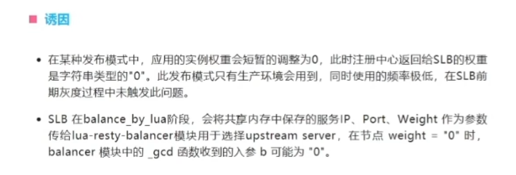
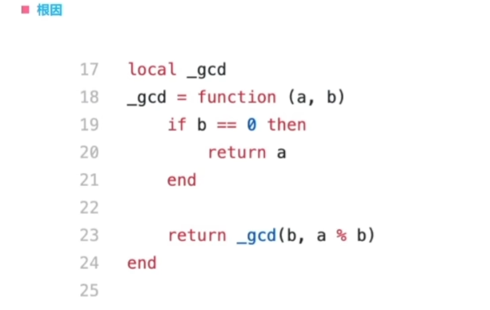

# Jmeter使用

## 优缺点
>### 优点
>* 开源免费
>* 真正的双枪老太婆，接口测试能力很强，性能测试能力也很强
>* 接口测试做完后，几乎不需要任何改动就可以做性能测试
>* 不仅仅擅长做接口性能测试，还可以做数据库压力测试等
>* 性能测试结果分析功能这一块做的也很专业
>* 做接口自动化测试时，不需要安装任何插件就可以支持命令行模式启动并集成在“Jenkins”中
>* 支持中文汉化版（其实也很一般，聊胜于无吧）
>* 由于功能没有Postman多，所以菜单也较少，对于极简主义人士来说，算是一个优点

>### 缺点
>* 版本更新慢
>* UI界面弱爆了
>* 从企业级接口测试工作的角度来说，用户易用性并没有Postman好
>* 开发人员不太用JMeter做开发接口的调试，所以在你做接口测试的过程中，一旦遇到问题，由于你们的工具环境不一样，交流成本就变高了
>* 不支持Swagger接口文档的接口快速导入（对于不喜欢这个功能的人不算是缺点）

>## 相关设置
>* **作用域：**
>   * 查看结果树可以拖动到特定请求下，生效范围只对父节点生效
>   * 清除结果-->查看结果树--->右键，清除
>   * 只发特定请求--->请求上右键--->禁用，启用
>* **修改配置文件**
>   * 乱码问题-->字符集不匹配。JMeter的默认字符集编码为'ISO-8859-1'，而实际在测试时，接收到的网站响应信息通常是UTF-8格式，可以在JMeter的bin目录下的jmeter.properties文件中增加一行：sampleresult.default.encoding=utf-8
>   * 支持中文，在jmeter.properties文件中增加一行：language=zh_CN

>## 测试计划（唯一根节点）
>### 右键菜单功能
>#### 线程
>* 线程组
>* setup线程组
>   * 永远最先运行的线程组
>* teardown线程组
>   * 永远最后运行的线程组（不会对每个线程组都setup和teardown）
>   * 多个setup或者teardown则按照在测试计划中的上下顺序先后执行，不论是否勾选独立运行每个线程组

>#### 配置元件
>* 接口调用时的辅助
>* 用户定义的变量 
>   * 添加一个变量管理，可以设置变量
>* CSV DataSet config（大数据量导入变量）
>   * 文本文件，可以使用execl和普通文本编辑器编辑
>   * 每次请求都不一样，不区分线程，
>   * 功能：
>      *  文件名-->csv地址
>      *  变量名--->每一列代表的变量名
>      *  忽略行首--->设置了行首？
>      *  遇见文件结束符结束循环--->数据结束了是否从新循环
>      *  分隔符设置，默认,
>* HTTP信息头管理器
>   * 管理网页的请求头信息，范围是父节点
>* HTTPCookie管理器
>   * 管理网页的cookie信息
>* HTTP缓存管理器
>   * 模拟网页打开缓存的情况（开启缓存可以大大减小服务器压力）
>   * 对于经常使用且刷新频率不高并且安全性
>* 参数化相关的功能：参数化，方便切换环境
>   * 用户定义的变量：（作用范围是全局）
>      *  添加 键值对 即可
>      *  使用方法：${变量名} 
>   * 用户参数:
>      * 当同一个变量取多个值的时候

>#### 监听器
>* 监听测试过程，可以创建在任意目录下
>##### 查看结果树（用于调试接口）
>* 取样器结果 页面
>   * load time 所有请求获得返回数据
>   * connect time  ：所有三次握手所花时间
>   * latency :收到第一个响应所花时间
>* 请求
>   * 请求头
>   * 请求体
>* 响应数据
>   * 响应头
>   * 响应体

>##### 聚合报告
>* （看性能报告结果--->**并发数**，**响应时间**，**事物成功率**）
>* Label：显示当前脚本的取样器名称
>* 样本：显示该条用例发送的总的请求次数
>* 平均值：所有请求的响应时间的平均值
>* 中位数：将所有请求按照响应时间排序，取50%位置的请求的响应时间的值即为中位数。因此可以理解为50%的请求响应时间小于等于中位数的值。
>* 90%百分位：将所有请求按照响应时间排序，取90%位置的请求的响应时间的值即为90%百分位。因此可以理解为90%的请求响应时间小于等于多少。
>* 95%百分位：将所有请求按照响应时间排序，取95%位置的请求的响应时间的值即为95%百分位。因此可以理解为95%的请求响应时间小于等于多少。
>* 99%百分位：将所有请求按照响应时间排序，取99%位置的请求的响应时间的值即为99%百分位。因此可以理解为99%的请求响应时间小于等于多少。
>* 最小值：所有请求中响应时间最小的一个值。
>* 最大值：所有请求中响应时间最大的一个值。
>* 异常%（失败率）：所有请求中发生异常导致请求失败的比率，比如10次请求，其中3次请求超时失败，那么异常率即为30%。
>* 吞吐率：表示服务端每秒处理多少请求。
>* 接收KB/sec：表示测试过程中，客户端每秒接收来自服务端的字节数，以KB为单位。
>* 发送KB/sec：表示测试过程中，客户端每秒发送给服务端的字节数，以KB为单位。

>#### 定时器
>* 设定任务执行的时间或吞吐量。定时器可以创建在任何目录下
>* 固定定时器：用于设置取样器在发送请求之前等待的时间
>* 同步定时器：Synchronizing（欣科瑞欣） Timer；用于极限并发，同时发起请求
>   *  模拟用户组的数量：设置几个用户为一组
>   *  超时时间：如果线程数不够，会等待一定时间（不设置会死等）(集合点)
>* 常数吞吐量定时器：Constant Throughput Timer；用于设置每秒钟发送的请求数
>   * 线程模式选择-->所有线程共享请求数，或每个线程都有这个请求数

>#### 前置处理器：发起请求前设置环境
>* 用户参数:（作用域为父节点内，放测试计划下则为全域，小批量使用）
>* 功能;
>   * 设置变量名
>   * 设置用户---->变量值
>   * 每次迭代更新一次
>      *  如果变量为函数方法
>      *  线程切换时才改变（默认请求一次就改变）
>* 使用方法：${变量名} 
>* 特点：
>   * 发起请求时，线程会分别使用不同变量
>   * 线程数量 > 变量数时，是循环读取使用变量
>   * 参数的每个值对应于一个并发用户，如果同一个用户循环执行多次，那么只会取同一个值

>#### 后置处理器：请求完成后处理环境
>##### 正则表达式提取器
>    * 使用方法：
>       * 设置提取位置，响应头，响应体（主体）
>       * 引用名称（保存成变量）
>       * 正则表达式
>       * 模板（选择正则表达式（$1$表示第一个））
>       * 匹配数字（多项结果时取第几项（-1代表都要，1表示第一项））
>       * 缺省值（默认值）（也可以勾选使用空默认值）

>##### JSON提取器
>* 使用方法：
>      * 设置提取位置，响应头，响应体（主体）
>      * 引用名称（保存成变量）
>      * jsonpath表达式
>      * match no （匹配到多个时的选择）
>      * 失败时的默认值

>##### 边界提取器
>   * 使用方法：（示例）
>      * 'Apply to'栏选择'Main sample and sub-samples'，
>      * '要检查的响应字段'选择'主体'，
>      * '引用名称'填写变量名'title'，
>      * '左边界'中填写'测试讲师'左边的内容，'右边界'中填写'测试讲师'右边的内容，
>      * '匹配数字(0代表随机)'中填写1，
>      * 勾选'使用空默认值'选项，

>#### 断言
>* 测试断言，可以添加在三级目录

>##### 响应断言
>* 检查响应信息是否符合预期
>* 设置检查“主请求”，“子请求”，“所有请求”；默认“主请求”-->Main samples only
>* 设置测试字段：响应头，响应体，或者响应代码等
>* 模式匹配规则
>   * 字符串：返回结果包括指定的内容，不支持正则表达式
>   * 包括：返回结果包括指定的内容，支持正则表达式
>   * 匹配：返回结果完全等于指定的内容，支持正则表达式
>   * 相等：返回结果完全等于指定的内容，不支持正则表达式
>   * 否：测试条件取反
>   * 或者：多个测试条件通过一个就行
>   * 测试模式：期望输出
>   * 断言通过不输出信息，不通过则报错

>##### JSON断言
>* JsonPath使用
>   * 符号：
>      *  根节点 $
>      *  层级关系连接符 .
>      *  当前节点 @
>      *  所有节点 *
>      *  数组列表下标 [number]
>      *  所有符合条件节点 ..
>      *  过滤 ?()
>* 构造jsonpath语句
>  * Additionally assert value
>     *  此选项表示是否判断目标节点的值，如果不勾选这个选项，则只要目标节点存在即验证通过，反之不通过；如果勾选了这个选项，不仅要节点存在，且节点的值必须等于'Expected Value'中的期望值，才能验证通过，反之则不通过
>  * Expect null
>     *  如果定位的节点期望值为null，则可以勾选这个选项。
>  * Invert assertion(will fail if above conditions met)
>     *  如果希望判断的结果取反
>##### 大小断言
> * 判断响应内容的大小（以字节为单位）
> * 响应字段大小
>       * 完整响应
>       * 响应头
>       * 响应体
>       * 响应代码
>       * 响应信息（OK 或者）

>##### 断言持续时间
>* 判断是否在限定的时间内得到响应数据，如果超时即校验失败，实际响应时间可查看结果树中的loadtime

> #### 测试计划的相关配置：
>* 独立运行每个线程组：按照线程组的顺序执行

>### 线程组独有功能
>#### 取样器：模拟各种请求
>* （debug samper）调试取样器：
>  * 显示提交的变量值，跟踪变量
>
>#### 逻辑控制器：控制业务代码的逻辑，进行流程控制
>* if控制器
>   * 需要将http请求拖到控制器节点下，控制器才生效
>   * 勾选--->使用推荐编译器生成表达式
>      *  工具--->函数助手（快速调用函数）
>      *  Evaluate for all children?
>         *  对节点下的每个请求都判断进行判断（默认不勾选，即判断一次执行所有请求）
>* while控制器
>* 循环控制器：控制单个请求的循环次数
>   * 当一个线程组下有多个取样器，其中不同的取样器希望执行不同的循环次数，这时就可以使用'循环控制器'元件。
>   * 使用方法：
>      *  将请求拖到控制器节点下，设置循环次数即可
>* 仅一次控制器：
>   * 请求只执行一次
>   * 使用方法：
>      *  将请求拖到控制器节点下即可
>* 事务控制器
>   * 将多个请求当成一个事务来观察性能，比如在百度使用'python'搜索，这个操作需要先打开百度首页，
>   * 然后输入'python'执行搜索，而我们希望观察这两步的整体性能情况，这时就可以使用'事务控制器'元件来实现
>   * 使用方法：
>      *  将多个请求放入事物控制器节点下即可
>      *  勾选--->只看父节点，则聚合报告中默认将所有请求的信息合并
>* 吞吐量控制器
>   * 将请求拖到控制器下即可
>   * 设置请求占比，默认为百分比制

>#### 线程组相关配置：
>* 线程数：发送请求的线程数
>* Ramp-Up:线程启动时间，在指定时间内启动 ”线程数“ 数量的线程
>* 延迟创建线程：保证精确的在启动时间内完成线程创建
>* 循环次数：每个线程发送请求次数
>* 调度器：在一段时间内执行
>  * 持续时间：持续运行的时间（循环次数要勾选：永远）
>  * 启动延迟：（强制等待=sleep）

>### 性能测试
>   * 模拟并发：
>      *  原理：多线程技术（multi thread）
>      *  操作：
>         * 建立线程组
>         * 设置线程属性-->线程数

>## Jmeter的相关使用场景
>### 上下游关联
>   * 从上一个请求中获取需要的信息
>      * 方法1：正则表达式 提取器（默认贪婪匹配模式）（匹配出一段字符串（目标的子集合））
>        *   .  表示匹配任何单字符
>        *   * 表示匹配0到多次
>        *   + 表示一次或多次
>        *   ？ 找到第一个匹配项后停止
>        *  （） 表示需要匹配的部分
>        *   \  转义符
>      * 方法2： JSON提取器
>      * 方法3： 边界提取器

>### 直连数据库
>* 安装第三方JDBC
>* 选择'添加' - '配置元件' - 'JDBC Connection Configuration'
>* 配置参数
>   * 在'Variable Name for created pool'栏中输入数据库连接池名称，如'test'；
>   * 在'Database URL'栏中输入数据库连接信息
>     *  如：jdbc:mysql://localhost:3306/test，表示连接的mysql数据库，部署地址是localhost，端口号是3306，访问的数据库名称为'test'；
>   * 在'JDBC Driver class'栏中选择对应的数据库驱动，如mysql数据库选择'com.mysql.jdbc.driver'
>   * 在'Username'和'Pass>                    * ord'中分别输入数据库连接的用户名和密码
>   * 选择取样器：JDBC request
>   * （激活数据库）
>* 配置JDBC request(分成了改（增删改），查两种)
>   * 在'Variable Name of Pool declared in JDBC Connection Configuration'栏中输入之前在'JDBC Connection Configuration'元件中设置的数据库连接名称，表示使用该连接来连接mysql数据库；
>   * 在'Query Type'栏中选择'Update Statement'，表示当前执行的SQL语句是用于修改数据库，
>   * 如果是select语句，则可以选择'Select Statement'；
>   * 在'Query'栏中输入要执行的SQL语句，

>## 非图形化启动
>* 命令：
>  *     jmeter -n -t test.jmx -l test.jtl
>       * 其中参数'-n' 表示 'non gui mode'，即非图形化模式；
>       * '-t'表示test file（即测试计划文件），后跟要运行的jmeter脚本的路径和文件名称；
>       * '-l'表示logfile，后面加上要生成的日志文件的路径和文件名称。
>* 比如上面的命令表示在非图形化模式下运行当前目录下的test.jmx文件，同时在当前目录生成一个名为'test.jtl'的日志文件。
>  * 生成测试报告：
>     *  已存在jtl文件
>       *     jmeter -g test.jtl -o .\test.html
>     *  不存在jtl文件
>       *     jmeter -n -t test.jmx -l test.jtl -e -o .\test.html

>## 分布式测试
>* 需要满足的条件：
>      * 要有一台控制机和多台客户机，客户机用于产生并发请求，控制机不产生请求，用于控制多台客户机同时发起请求
>      * 控制机和客户机上安装的JDK版本和JMeter版本必须完全相同
>      * 控制机和客户机必须禁用SSL检查
>      * 控制机和客户机必须在一个网络中，可以互相访问
>      * 关闭控制机和客户机上的防火墙
>* 步骤：
>   * 安装jdk和Jmeter
>   * （关闭防火墙）
>   * （修改目录下bin目录下的jmeter.properties文件，将server_port的值改成不同的端口号，一台电脑模拟用）
>   * 将两台客户机中的jmeter.properties文件中的server.rmi.ssl.disable项设置成true，表示禁用SSL的校验
>   * 修改控制机的bin目录下的jmeter.properties文件，将remote_hosts的值改成客户机的ip和端口号，用逗号分隔
>   * 将控制机的server.rmi.ssl.disable同样设置成true；同时将mode=Standard的注释去掉
>   * 分别运行两个客户机的bin目录下的jmeter-server.bat文件，此时每个客户端都会出现一个控制台窗口，不要关闭该窗口
>   * 打开控制机的JMeter界面，新增一个取样器，设置线程数（每台电脑都是这个线程数）
>   * 点击上方菜单'运行'，选择'远程启动所有'，执行请求

>## 性能监控工具
>* CPU:
>     * 如果CPU使用率一段时间达到100%且请求出错，可以提bug
>* 内存：
>   * 内存占用不断上升，不下降
>* windos
>* linux
>   * 安装nmon
>     *     apt install nmon
>   * 使用：
>     *     nmon -s3 -c60 -f -m ./report
>     *  其中'-s3'表示每3秒收集一次性能信息，'-c60'表示收集60次，'-f'表示生成的文件名包含该文件创建时间，'-m ./report'指定测试报告保存路径，此处表示将测试报告保存到当前目录下的report目录中
>   * 阅读报告：
>     * 通过一个叫做'nmon-analyser'的工具打开并阅读，可以通过访问以下地址下载该工具：
>     * [下载地址](/http://nmon.sourceforge.net/pmwiki.php?n=Site.Nmon-Analyser)
>     * 将下载的压缩包解压缩，双击打开其中的xlsm文件，并点击'Analyze nmon data'按钮加载性能测试报告文件
>     * 要启用宏
>     * 选择之前在Linux中生成的测试报告文件，打开后会生成一个新的与原测试报告文件同名的excel文件
### 性能分析
>* 某个视频网站崩溃案例
>   * perf是nginx中的性能分析感觉，分析热点函数的CPU占有率，从而找到性能瓶颈
>   * lua程序分析工具，跑火焰图，发现热点函数
>   * 在热点函数内部添加debug日志，重启观察这些热点函数的运行情况
>   * 根因：_gcd函数返回预期外的值nan ,触发诱因，某个容器IP的weight= 0
>   * 解决办法：
>      *  平台禁止该发布模式，SLB强制指定注册中心返回的权重
>* 
>   * 权重是是数字 0 ，返回的是数字字符串 “0”
>   * lua是动态类型
>   * 后续预防
>   *  

#### 火焰图
>* 火焰图以一个全局的视野来看待时间分布，它从底部往顶部，列出所有可能导致性能瓶颈的调用栈。
##### 分类
>   * on -cpu
>      *  对cpu占用做分析
>   * off-cpu
>      *  对IO做分析
>   * 内存火焰图
>      *  对内存做分析
>   * 综合火焰图
>      *  对cpu和IO一起分析
>   * 图示：
>      *  
##### 特点（以on-cpu举例）
>   * 每一列代表一个调用栈，每一个格子代表一个函数
>   * 纵轴展示了栈的深度，按照调用关系从下到上排列。
>   * 最顶上格子代表采样时，正在占用 cpu 的函数。
>   * 横轴的意义是指：火焰图将采集的多个调用栈信息，通过按字母横向排序的方式将众多信息聚合在一起。需要注意的是它并不代表时间。
>   * 横轴格子的宽度代表其在采样中出现频率，所以一个格子的宽度越大，说明它是瓶颈原因的可能性就越大。
>   * 火焰图格子的颜色是随机的暖色调，方便区分各个调用信息。
>   * 其他的采样方式也可以使用火焰图， on-cpu 火焰图横轴是指 cpu 占用时间，off-cpu 火焰图横轴则代表阻塞时间。
>   * 采样可以是单线程、多线程、多进程甚至是多 host，进阶用法可以参考附录进阶阅读
##### 使用方法
###### SystemTap 
>* 机制：
>   * 通过探针机制，来采集内核或者应用程序的运行信息，从而可以不用修改内核和应用程序的代码，就获得丰富的信息，帮你分析、定位想要排查的问题
>* 绘制过程：
>   * 安装 SystemTap 以及 操作系统符号调试表
>      *  使用 yum 工具安装 systemtap:
>         *  yum install systemtap systemtap-runtime
>   * 根据自己所需绘制的火焰图类型以及进程类型选择合适的脚本
>   * 生成内核模块
>   * 运行 SystemTap 或者运行生成的内核模块统计数据
>   * 将统计数据转换成火焰图
###### perf
>* 安装perf
>   * apt-get install linux-tools-common linux-tools-generic linux-tools-`uname -r`
>   * perf list 查看安装是否完成
>* 下载FlameGraph
>   * 安装git
>   * 通过git下载
>       *      git clone git@github.com:brendangregg/FlameGraph.git
>* perf统计信息
>   * perf stat
>      *  查看程序运行过程中各种event的统计
>   * 使用perf record和perf report命令来进行更详细的分析,并生成火焰图
>      *  $ sudo perf record -g -F 99 -- cp -r ~/aaa/ ./aaa.test
>      *  $ sudo perf script -i perf.data > out.perf
>      *  $ ../FlameGraph/stackcollapse-perf.pl out.perf > out.floded
>      *  $ ../FlameGraph/flamegraph.pl out.floded > cp.svg
>      *  $ ls
>      *  cp.svg  aaa.test  out.floded  out.perf  perf.data
>   * 对于正在运行的程序 可以直接使用 pert stat -p pid 或者perf record -g -e cpu-clock -pid生成perf.data数据用于分析。
>* 查看火焰图
>  * 生成红蓝差分火焰图
>     *  重新抓取数据
>        *  $ sudo perf record -g -F 99 -- cp -r ~/bbb/ ./bbb.test
>        *  $ sudo perf script -i perf.data > out1.perf
>        *  $ ../FlameGraph/stackcollapse-perf.pl out1.perf > out1.floded
>        *  $ ../FlameGraph/flamegraph.pl out1.floded > cp1.svg
>        *  $ ../FlameGraph/difffolded.pl out.floded  out1.floded > diff1.floded 
>        *  $ ../FlameGraph/flamegraph.pl --negate diff1.floded > diff1.svg
>     *  进行对比
>        * $ ../FlameGraph/difffolded.pl out.floded  out1.floded > diff1.floded 
>        * $ ../FlameGraph/flamegraph.pl --negate diff1.floded > diff1.svg

##### 分析技巧：
>   * 纵轴代表调用栈的深度（栈桢数），用于表示函数间调用关系：下面的函数是上面函数的父函数。
>   * 横轴代表调用频次，一个格子的宽度越大，越说明其可能是瓶颈原因。
>   * 不同类型火焰图适合优化的场景不同，比如 on-cpu 火焰图适合分析 cpu 占用高的问题函数，off-cpu 火焰图适合解决阻塞和锁抢占问题。
>   * 无意义的事情：横向先后顺序是为了聚合，跟函数间依赖或调用关系无关；火焰图各种颜色是为方便区分，本身不具有特殊含义
>   * cpu 火焰图
>      *  cpu占用时间调用栈找出 cpu 占用高的问题函数；
>      *  分析代码热路径固定频率采样 cpu 调用栈
>   * off-cpu 火焰图
>      *  阻塞时间调用栈i/o、网络等阻塞场景导致的性能下降；
>      *  锁竞争、死锁导致的性能下降问题固定频率采样 阻塞事件调用栈
>   * 内存火焰图
>      *  内存申请/释放函数调用次数调用栈内存泄露问题；
>      *  内存占用高的对象/申请内存多的函数；
>      *  虚拟内存或物理内存泄露问题有四种方式： 跟踪malloc/free；跟踪brk；跟踪mmap；
>      *  跟踪页错误
>   * Hot/Cold 火焰图
>      *  on-CPU 火焰图和 off-CPU 火焰图结合在一起综合展示调用栈需要结合 cpu 占用以及阻塞分析的场景；
>      *  off-CPU 火焰图无法直观判断问题的场景on-CPU 火焰图和 off-CPU 火焰图结合

